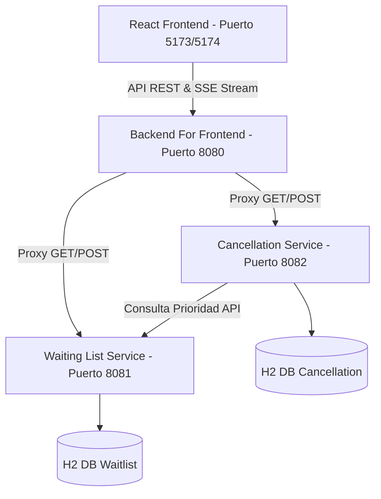

# RedNorte - Sistema de Gestión de Horas Médicas y Lista de Espera

Este repositorio contiene la solución completa de software para la gestión de agendas clínicas, cancelaciones y reasignación automatizada de horas médicas en base a prioridad para la clínica **RedNorte**.

El proyecto está diseñado bajo una arquitectura distribuida de microservicios que implementa patrones de diseño y arquitectónicos avanzados, garantizando eficiencia, mantenibilidad y escalabilidad.

---

## 1. Arquitectura del Sistema

La solución está dividida en componentes independientes e integrados mediante red:

*   **Frontend (React + Vite):** Portal del Paciente, Portal del Médico y Portal de Recepción/Check-in.
*   **Backend for Frontend (BFF) (Puerto `8080`):** Centraliza la comunicación del frontend, expone el canal de transmisión de eventos en tiempo real (SSE) y consolida llamadas concurrentes a los microservicios.
*   **Microservicio de Lista de Espera (Puerto `8081`):** Gestiona pacientes, personal de salud, solicitudes e implementa la regla de negocio de priorización.
*   **Microservicio de Cancelación (Puerto `8082`):** Administra la agenda de citas, procesa check-ins, cancelaciones, ejecuta el algoritmo de reasignación y audita notificaciones.



---

## 2. Patrones de Diseño Implementados

1.  **Patrón Observer (Suscripción SSE):** Implementado en el Frontend ([ObserverContext.tsx](rednorte-frontend/src/observer/ObserverContext.tsx)) para reaccionar a los eventos en tiempo real distribuidos por el BFF.
2.  **Patrón BFF / API Proxy:** Centraliza las rutas de la API en [BffController.java](rednorte-backend/rednorte-bff/src/main/java/com/rednorte/bff/controller/BffController.java) y agrega la información del paciente.
3.  **Patrón Repository:** Desacopla la lógica de negocio del almacenamiento de datos usando Spring Data JPA (`JpaRepository`).

---

## 3. Requisitos Previos

Para ejecutar la solución en local de manera integrada, asegúrate de contar con:
*   **Java JDK 17 o superior** (Java 21 recomendado).
*   **Node.js LTS** (v18 o superior).

---

## 4. Guía de Ejecución Local (Paso a Paso)

Abre terminales independientes para cada componente y sigue el siguiente orden:

### Paso 1: Levantar los Microservicios de Backend

#### A. Iniciar el Servicio de Lista de Espera (Puerto `8081`)
```bash
cd rednorte-backend/waiting-list-service
./mvnw.cmd spring-boot:run
```

#### B. Iniciar el Servicio de Cancelación (Puerto `8082`)
```bash
cd rednorte-backend/cancellation-service
./mvnw.cmd spring-boot:run
```

#### C. Iniciar el BFF (Puerto `8080`)
```bash
cd rednorte-backend/rednorte-bff
./mvnw.cmd spring-boot:run
```

### Paso 2: Levantar el Frontend React
```bash
cd rednorte-frontend
npm install
npm run dev
```

Navega a la URL proporcionada en la consola (por lo general, `http://localhost:5173` o `http://localhost:5174`).

---

## 5. Pruebas Automatizadas
Para verificar el correcto funcionamiento y cálculo de las prioridades clínicas en base a la edad y severidad, ejecuta el siguiente comando en cualquiera de los microservicios de backend:
```bash
./mvnw.cmd test
```

---

## 6. Persistencia Temporal
Por defecto, el backend está configurado para utilizar base de datos **H2 en memoria** (`jdbc:h2:mem:...`). No es necesario instalar ningún motor de base de datos en el equipo. Los datos se inicializan automáticamente con registros de prueba al arrancar los servicios (`DataLoader.java`).
